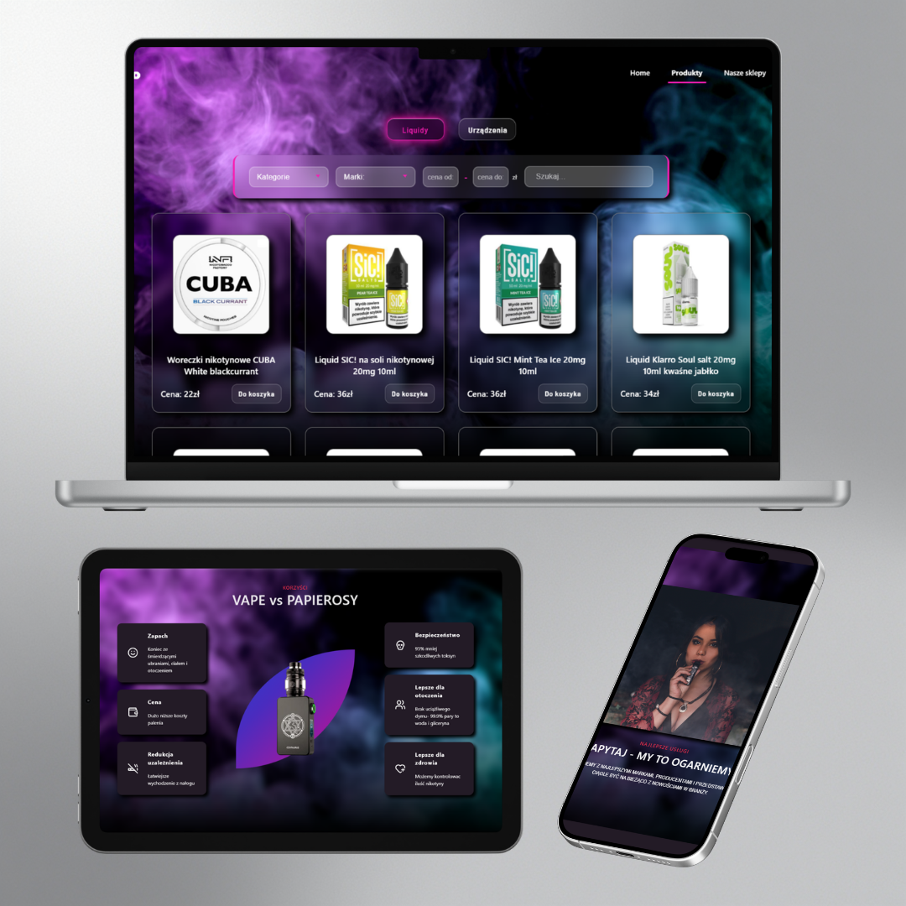

## 🛍️ **E-commerce Vape Shop**

A modern e-commerce application built with **React** and **Strapi CMS**.
Originally developed as a commercial project for a client.
The project was paused due to legal requirements on the client side.

This project was created to demonstrate real-world frontend architecture, API integration, state management, and scalable application design.

🚀 **Live Demo**
 https://vapeshop-platform.netlify.app/

🎯 **Project Purpose**
The goal of this project was to:

 

 - Build a production-ready e-commerce application
 - Integrate a headless CMS (Strapi)
 - Practice advanced filtering and pagination
 - Manage global state using Redux Toolkit
 - Work with real API communication (GET and POST requests)
 - Clean and semantic Git history (Conventional Commits)

🛠️ **Tech Stack**

*Frontend*
 - React
 - React Router
 - Redux Toolkit
 - Redux Persist
 - Custom Hooks
 - Styled Components
 - React Hot Toast
 - Vite

*Backend*
 - Strapi (Headless CMS)
 - REST API

**🏗️ Architecture Overview**

The application follows a component-based architecture with clear separation between UI and business logic.  
- Feature-based folder structure  
- Global state managed with Redux Toolkit  
- API layer separated from UI components  
- Reusable custom hooks for shared logic

🔎 **Advanced Filtering System**
Products can be filtered by:

 - Category 
 - Brand
 - Price range (min / max)
 - Product name (search input)
 
Filtering is synchronized with pagination and backend data.

📝 **Order Form with Real-Time Validation**
The checkout form includes:

 - Text inputs
 - Select field
 - Checkbox field
 - Required field validation
 - Immediate error messages for each input
 - Validation before form submission

Each input is validated separately.
If the user enters incorrect data, an error message appears immediately.

This approach:

 - Improves user experience
 - Prevents sending invalid data
 - Ensures better data quality
 - Simulates real production-level form behavior
 
The validated data is then sent to Strapi via REST API.

🎠 **Custom Infinity Carousel**

 - Client testimonials section
 - Custom animation logic (no external carousel library used)

📱 Responsive Design (RWD)

 - Mobile-first approach
 - Media queries
 - Layout adapted across breakpoints
 - Desktop navigation
 - Hamburger menu for mobile devices

🔝 **UX Enhancements**

 - ScrollToTop on route change
 - Toast notifications
 - Age verification modal
 - Loading state handling (skeleton loaders)

🧠 **Engineering Focus**

This project demonstrates understanding of:

 - Controlled components
 - Form state management
 - Input validation patterns
 - Separation of UI and logic
 - Reusable custom hooks
 - API error handling
 - Scalable folder structure
 - Clean Git workflow (Conventional Commits). This reflects professional development workflow and team-ready practices.

📌 **Summary**

This project reflects my ability to build scalable frontend applications connected to a real backend CMS, with focus on user experience, clean architecture, and production-ready solutions.

🤝 **Let’s Connect**

If you are interested in this project or would like to discuss my experience,  
feel free to contact me.

I am currently looking for a **Junior Frontend Developer opportunity** and would be happy to talk about how I can contribute to your team.

📧 Email:  **sandra.mstowskaa@gmail.com**  
💼 LinkedIn: **https://www.linkedin.com/in/sandra-mstowska-962368376/** 

